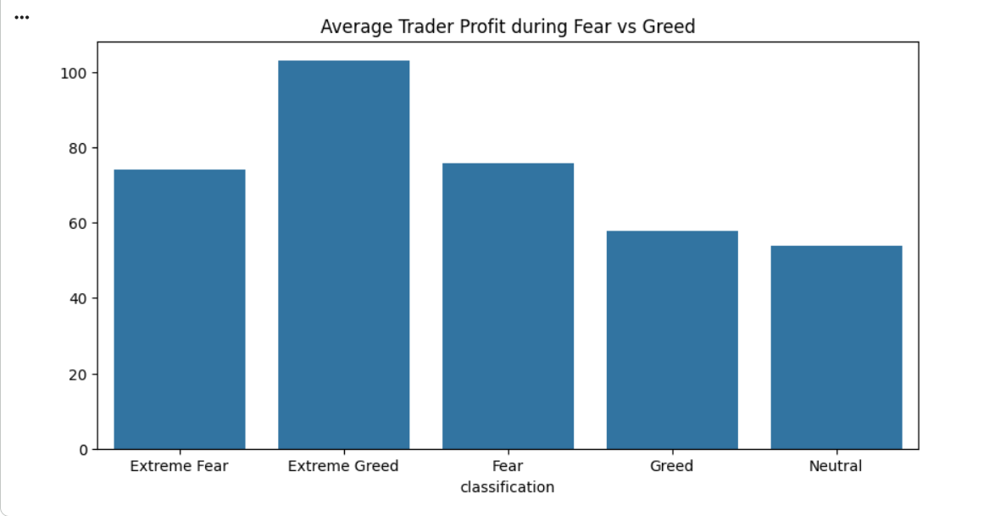
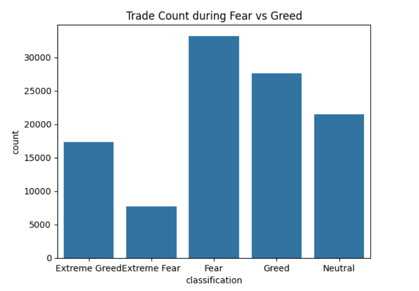
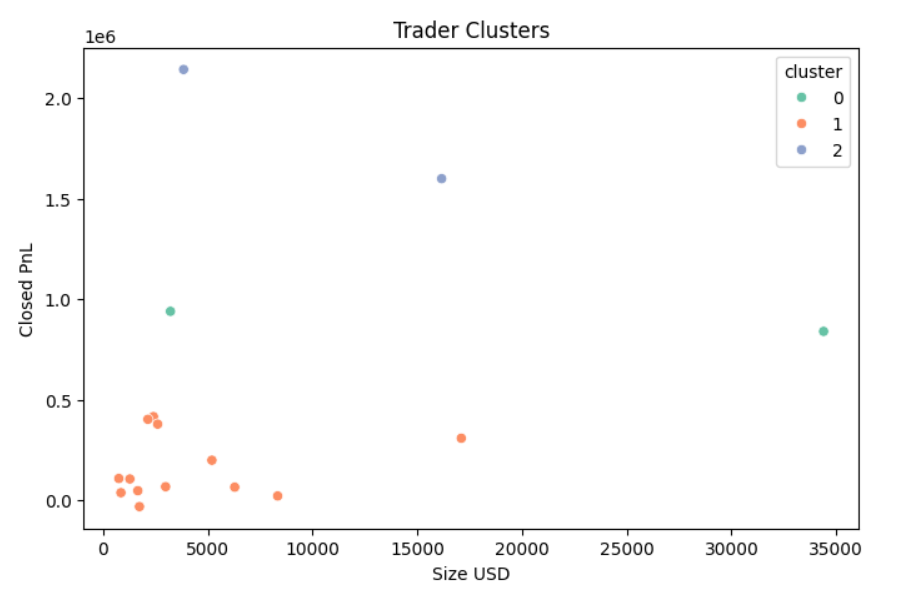
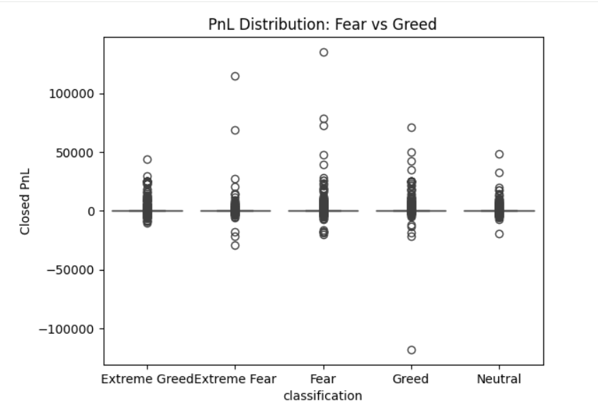

# Trader Performance vs Market Sentiment Analysis

End-to-end data analysis of trader performance vs market sentiment (Fear & Greed) using Hyperliquid trading data.  
This project explores how trader behavior and profitability change under different market sentiments and provides actionable strategy insights.

## Project Objective
Analyze the relationship between **market sentiment (Fear / Greed)** and **trader behavior & performance**.
The goal is to identify patterns that could help in building smarter trading strategies.


## Dataset Used
1. Fear & Greed Market Sentiment Dataset
2. Historical Trader Data (Hyperliquid)

These datasets were merged on a daily basis to analyze trading behavior relative to market sentiment.


## Project Workflow
Data Collection → Data Cleaning → Feature Engineering → Data Analysis → Visualization → Predictive Modeling → Trader Clustering → Insights & Strategy


## Folder Structure
```trader-sentiment-analysis
.
│
├── notebook.ipynb
├── fear_greed_index.csv
├── historical_data.csv
├── merged_data.csv
├── README.md
│
└── chart
├── 1.png
├── 2.png
├── 3.png
├── 4.png
```


## Data Preparation
Steps performed:

- Loaded both datasets
- Checked missing values and duplicates
- Converted timestamps into proper datetime format
- Extracted daily date values
- Merged trader data with sentiment dataset
- Created new analysis metrics

Key Metrics Created:
- Daily PnL per trader
- Trade frequency
- Average trade size
- Long vs Short ratio
- Sentiment-based analysis


## Exploratory Data Analysis

### Market Sentiment Distribution


### Trader Activity by Sentiment


### Trader Behavior Clustering


### PnL Distribution (Fear vs Greed)



## Key Insights

1. Traders tend to trade more actively during **Greed** market conditions.
2. Profit volatility increases significantly during **Fear periods**.
3. High trade size traders show higher risk but also higher potential profit.
4. Some traders consistently outperform others regardless of sentiment.


## Predictive Modeling (Bonus Task)

A simple **Random Forest model** was built to predict trader profitability using:

- Market sentiment
- Trade size
- Execution price

Model Objective:
Predict whether a trader will be **profitable or not** on a given trading day.

## Trader Clustering (Bonus Task)

Traders were grouped into behavioral segments using **K-Means Clustering**:

Cluster Types:
- Conservative traders
- High-risk traders
- Consistent profitable traders

This helps identify different trading styles.


## Strategy Recommendations

Based on the analysis:

**Strategy 1**
Reduce leverage during Fear market conditions to minimize losses.

**Strategy 2**
Increase trading activity during Greed periods where market momentum is stronger.

**Strategy 3**
Focus on optimized trade sizes rather than frequent trades during volatile markets.


## Tools & Technologies Used

- Python
- Pandas
- NumPy
- Matplotlib
- Seaborn
- Scikit-learn
- Google Colab


## How to Run the Project

1. Clone the repository
2. Open the notebook
3. Install dependencies
4. Run all cells


## Author
Gaurav Kumar  
